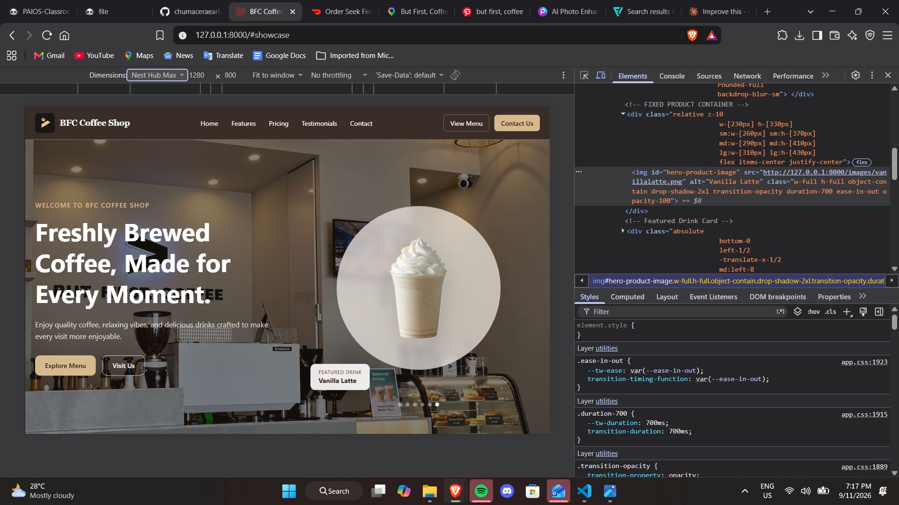
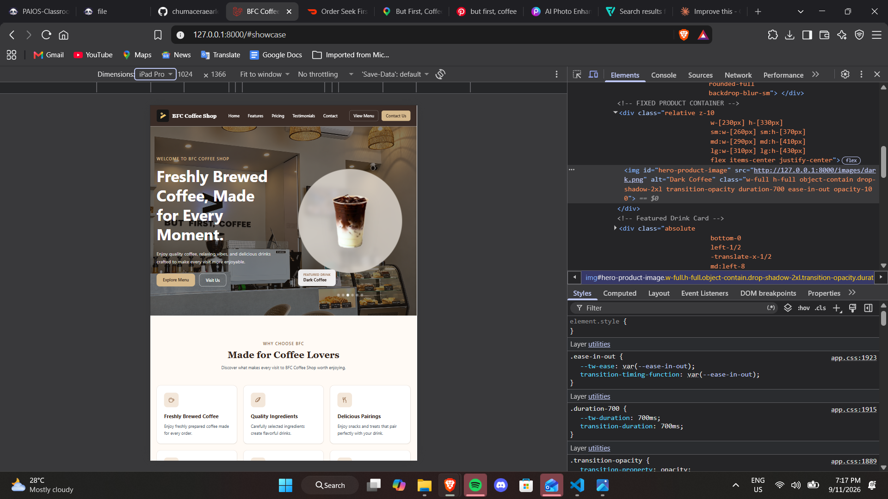
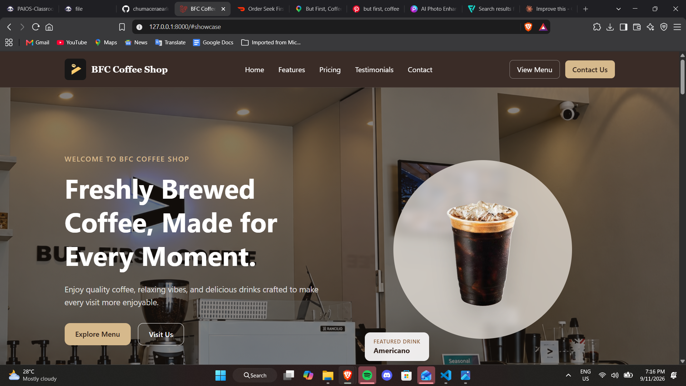

# Week 05 Mini Project 04 – Responsive Product Landing Page

## BFC Coffee Shop

A responsive product landing page developed using Laravel, Blade Components, and Tailwind CSS. The website is based on BFC Coffee Shop and presents its coffee products through a modern, responsive, and reusable interface.

---

## Introduction

This project was developed for **ITST 302 – Client-Server Technologies** as part of the Week 05 laboratory activity.

The goal of the project is to create a modern and responsive product landing page for an existing business using Laravel and Tailwind CSS.

For this project, **BFC Coffee Shop (But First, Coffee)** was selected as the business. The landing page presents featured coffee products, customer reviews, coffee packages, and other information through a clean and responsive user interface.

Laravel was used to organize the application and Blade Components were used to create reusable sections of the website. Tailwind CSS was used for styling, responsive layouts, spacing, typography, hover effects, shadows, and other visual elements.

---

## Objectives

The objectives of this project are to:

1. Develop a responsive product landing page using Laravel.
2. Apply Laravel Blade templating to organize the user interface.
3. Create reusable Blade Components for different sections of the website.
4. Use Tailwind CSS to design a modern and responsive interface.
5. Apply responsive Grid and Flexbox layouts.
6. Present products and business information in an organized manner.
7. Optimize the website for desktop, laptop, tablet, and mobile devices.
8. Practice proper Git and GitHub version control using meaningful commits.

---

## Business Selected

**Business Name:** BFC Coffee Shop / But First, Coffee

The project uses BFC Coffee Shop as the inspiration for the landing page. The design follows a coffee-inspired visual theme using brown, beige, cream, and neutral colors.

The landing page includes product images and customer feedback to create a more realistic presentation of the selected business.

---

## Development Environment

The following technologies and tools were used in developing the project:

- **Laravel** – Web application framework
- **PHP** – Server-side programming language
- **Blade** – Laravel templating engine
- **Tailwind CSS** – Utility-first CSS framework
- **Vite** – Front-end development and asset build tool
- **HTML** – Page structure
- **JavaScript** – Interactive elements and product transitions
- **Composer** – PHP dependency manager
- **NPM** – Front-end package manager
- **Git** – Version control
- **GitHub** – Repository hosting
- **Visual Studio Code** – Code editor
- **Google Chrome DevTools** – Responsive design testing

---

## Installation and Setup

### 1. Clone the Repository

```bash
git clone https://github.com/chumaceraearlecc-design/week05-product-landing-page.git
```

### 2. Open the Project Directory

```bash
cd week05-product-landing-page
```

### 3. Install PHP Dependencies

```bash
composer install
```

### 4. Install Front-End Dependencies

```bash
npm install
```

### 5. Create the Environment File

Copy the `.env.example` file and rename the copy to:

```text
.env
```

### 6. Generate the Laravel Application Key

```bash
php artisan key:generate
```

### 7. Start the Vite Development Server

```bash
npm run dev
```

Keep this terminal running.

### 8. Start the Laravel Development Server

Open another terminal and run:

```bash
php artisan serve
```

The application can then be opened through:

```text
http://127.0.0.1:8000
```

---

## Project Structure

Important files and folders used in this project include:

```text
week05-product-landing-page/
│
├── app/
├── bootstrap/
├── config/
├── database/
├── public/
│   └── images/
│       ├── logo.jpg
│       ├── background.png
│       ├── americano.png
│       ├── caramel.png
│       ├── dark.png
│       ├── icespanishlatter.png
│       ├── matchaespresso-removebg-preview.png
│       └── vanillalatte.png
│
├── resources/
│   ├── css/
│   │   └── app.css
│   ├── js/
│   │   └── app.js
│   └── views/
│       ├── components/
│       │   ├── navbar.blade.php
│       │   ├── hero.blade.php
│       │   ├── feature-card.blade.php
│       │   ├── product-showcase.blade.php
│       │   ├── pricing-card.blade.php
│       │   ├── testimonial-card.blade.php
│       │   ├── button.blade.php
│       │   └── footer.blade.php
│       │
│       ├── layouts/
│       │   └── app.blade.php
│       │
│       └── pages/
│           └── home.blade.php
│
├── routes/
│   └── web.php
│
├── screenshots/
└── README.md
```

---

# Landing Page Sections

## 1. Responsive Navbar

The navigation bar provides quick access to the major sections of the landing page.

It includes:

- BFC Coffee Shop logo
- Home
- Features
- Pricing
- Testimonials
- Contact
- Action buttons
- Responsive mobile navigation

On smaller screens, the navigation links are converted into a mobile menu to provide a better user experience.

---

## 2. Hero Section

The Hero section introduces BFC Coffee Shop using a large coffee shop background image, headline, description, call-to-action buttons, and featured coffee products.

The featured product automatically changes using a smooth fade transition.

Some of the displayed products include:

- Americano
- Caramel
- Dark Coffee
- Spanish Latte
- Matcha Espresso
- Vanilla Latte

---

## 3. Features Section

The Features section presents six characteristics of the coffee shop experience:

1. Freshly Brewed Coffee
2. Quality Ingredients
3. Delicious Pairings
4. Cozy Atmosphere
5. Friendly Service
6. Great Value

Each feature is displayed through a reusable Blade Component containing an icon, title, and description.

---

## 4. Product Showcase

The Product Showcase presents featured BFC Coffee Shop drinks using responsive product cards.

The cards automatically adjust depending on the screen size. Product images use consistent containers and responsive sizing to maintain an organized appearance.

The section also highlights the desktop and mobile experience of the landing page.

---

## 5. Coffee Packages / Pricing

The Pricing section demonstrates three sample coffee packages:

### Solo Coffee – ₱119

- 1 Featured Coffee Drink
- Choice of Hot or Iced
- Perfect for Individual Orders

### Coffee + Snack – ₱169

- 1 Featured Coffee Drink
- 1 Selected Snack
- Great for Coffee Breaks

### BFC Bundle – ₱229

- 2 Featured Drinks
- 1 Selected Snack
- Perfect for Sharing

> **Note:** The packages and prices shown in this section are sample content created for this academic landing page project and should not be treated as official BFC Coffee Shop pricing.

---

## 6. Customer Testimonials

The Testimonials section presents customer feedback about BFC Coffee Shop.

Each testimonial is displayed using a reusable `testimonial-card.blade.php` component containing:

- Customer photo
- Customer name
- Customer type/position
- Star rating
- Review

The section helps demonstrate how real-world customer feedback can be presented through a responsive card layout.

---

## 7. Call to Action

A Call to Action section is included near the bottom of the landing page to encourage users to interact with the website.

The CTA uses contrasting colors, responsive buttons, hover effects, and a centered layout to attract user attention.

---

## 8. Footer

The Footer provides additional business and navigation information.

It contains:

- BFC Coffee Shop logo and company information
- Quick Links
- Contact section
- Social media icons
- Copyright information

The Footer also adjusts automatically for smaller screen sizes.

---

# Reusable Blade Components

Reusable Blade Components were created to reduce repeated code and improve the organization of the application.

The project includes:

```text
navbar.blade.php
hero.blade.php
feature-card.blade.php
product-showcase.blade.php
pricing-card.blade.php
testimonial-card.blade.php
button.blade.php
footer.blade.php
```

Using Blade Components makes the interface easier to maintain because individual sections can be updated without placing all of their code directly inside the main page.

---

# Tailwind CSS Implementation

Tailwind CSS was used throughout the project for:

- Responsive layouts
- Grid
- Flexbox
- Typography
- Background colors
- Text colors
- Padding and margins
- Borders
- Rounded corners
- Shadows
- Hover effects
- Transitions
- Responsive breakpoints

Responsive classes such as the following were used:

```text
sm:
md:
lg:
```

These breakpoints allow the interface to adjust based on the user's screen size.

---

# Responsive Design

The website was tested at different screen sizes using browser developer tools.

The interface was optimized for:

- Mobile
- Tablet
- Laptop
- Desktop

Elements such as the navigation bar, product cards, pricing cards, testimonials, buttons, and footer automatically adjust based on the available screen width.

---

# Screenshots

## Desktop View



## Laptop View

.png)

## Tablet View



## Mobile View


## Navbar



## Hero Section


## Features Section

.png)

## Pricing Section


## Testimonials Section


## Footer

.png)

## VS Code Project Structure


## Blade Components / Project Structure


## GitHub Repository


---

# Problems Encountered

## 1. Vite Manifest Error

One of the issues encountered during development was the following error:

```text
Vite manifest not found
```

This happened when the Vite development server was not running.

### Solution

The problem was resolved by running:

```bash
npm run dev
```

while keeping the Laravel development server running in another terminal.

---

## 2. Responsive Navigation

The desktop navigation bar did not initially provide an ideal experience on smaller screens.

### Solution

Responsive Tailwind CSS classes were applied and a mobile navigation menu was added. JavaScript was also used to open and close the mobile menu.

---

## 3. Product Image Sizing

Some product images appeared larger or smaller than others because the original image files had different dimensions and transparent spacing.

### Solution

Fixed product containers and `object-contain` were used to provide more consistent product presentation.

---

## 4. Product Slider

The Hero section needed a smooth way to display multiple featured products without changing the size of the layout.

### Solution

JavaScript was used to automatically change the featured product while applying an opacity transition for a smooth fade effect.

---

# Solutions and Improvements

During the development process, several improvements were implemented:

- Added responsive navigation
- Added reusable Blade Components
- Added actual BFC branding and product images
- Improved product image consistency
- Added a responsive product showcase
- Added customer testimonials
- Added hover and transition effects
- Improved spacing and typography
- Added responsive pricing cards
- Added a responsive footer
- Tested the interface on multiple screen sizes

---

# Before and After

The initial version of the project contained a basic Laravel landing page structure with limited styling and content.

The final version was improved by adding:

- BFC Coffee Shop branding
- Responsive navigation
- Coffee shop background imagery
- Featured product animations
- Six feature cards
- Product showcase cards
- Coffee package cards
- Customer testimonials
- Call-to-action section
- Complete footer
- Responsive layouts for multiple devices

These improvements transformed the initial layout into a more complete and visually organized responsive product landing page.

---

# Reflection

Developing the BFC Coffee Shop responsive product landing page helped me better understand how Laravel, Blade Components, and Tailwind CSS can work together when building a modern website.

One of the most important things I learned from this project was how reusable components can make a project more organized. Instead of placing all of the HTML and Tailwind CSS code inside one file, I separated major parts of the website into components such as the navbar, hero section, feature cards, pricing cards, testimonial cards, buttons, and footer. This made the project easier to understand and maintain.

I also learned more about responsive web design. While developing the landing page, I tested the interface on mobile, tablet, laptop, and desktop screen sizes. I needed to make sure that navigation links, product cards, images, buttons, testimonials, and other elements adjusted properly depending on the available screen width. Tailwind CSS breakpoints, Grid, and Flexbox helped make this easier.

Another challenge was displaying product images consistently because the images had different sizes and transparent spaces. I solved this by creating fixed image containers and using object-contain. I also added a simple JavaScript product transition in the Hero section to make the landing page more interactive.

Overall, this project improved my understanding of Laravel Blade templating, reusable components, responsive design, Tailwind CSS, Git, and GitHub. It also helped me understand how a real business can be used as inspiration when designing and developing a responsive landing page.

---

# GitHub Repository

Repository Name:

```text
week05-product-landing-page
```

GitHub Repository:

```text
https://github.com/chumaceraearlecc-design/week05-product-landing-page
```

---

## Author

**Earl Chumacera**

ITST 302 – Client-Server Technologies

---

## Academic Project Notice

This website was created for educational purposes as part of a Client-Server Technologies laboratory activity.

BFC Coffee Shop is used as the selected existing business for the landing page project. Sample packages or pricing included in this project are for academic demonstration purposes and are not presented as official business offers.