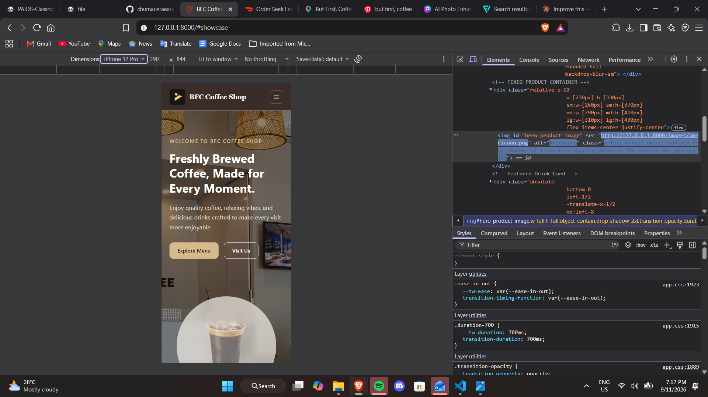
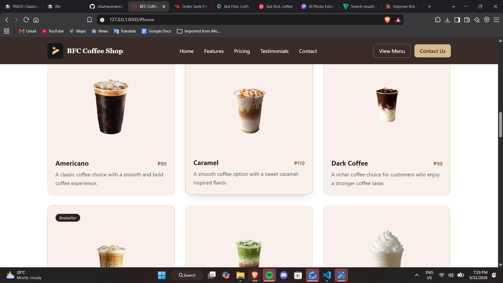
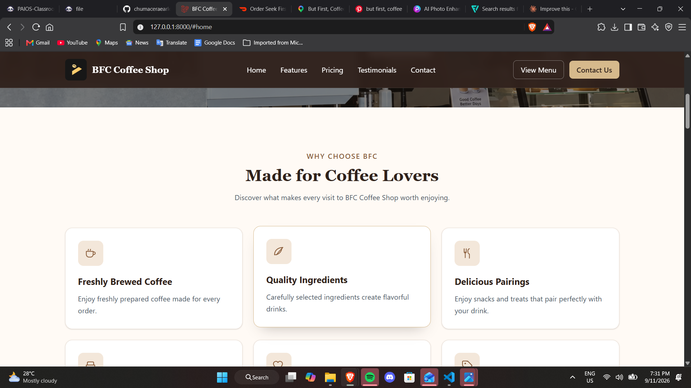
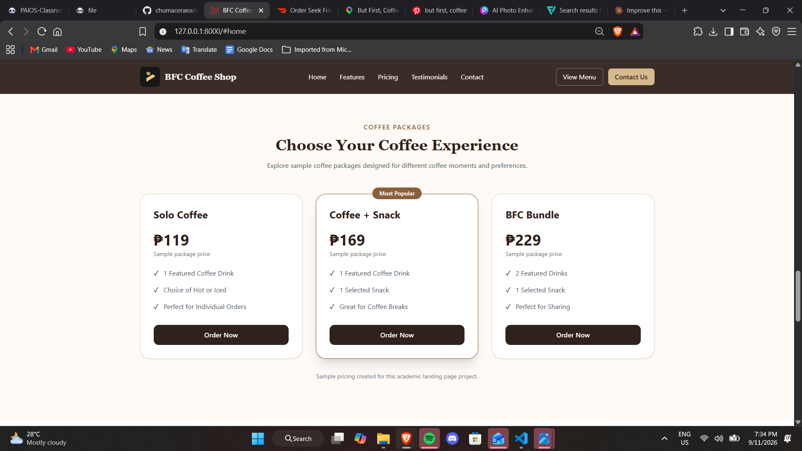
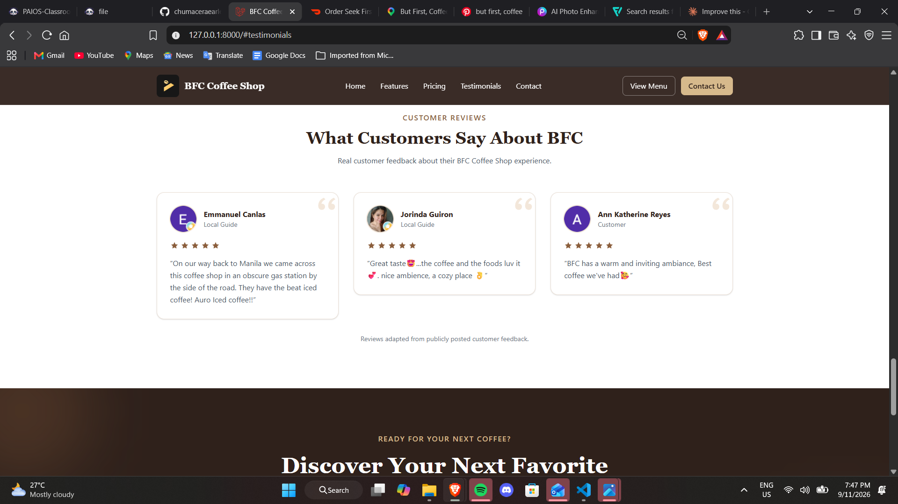
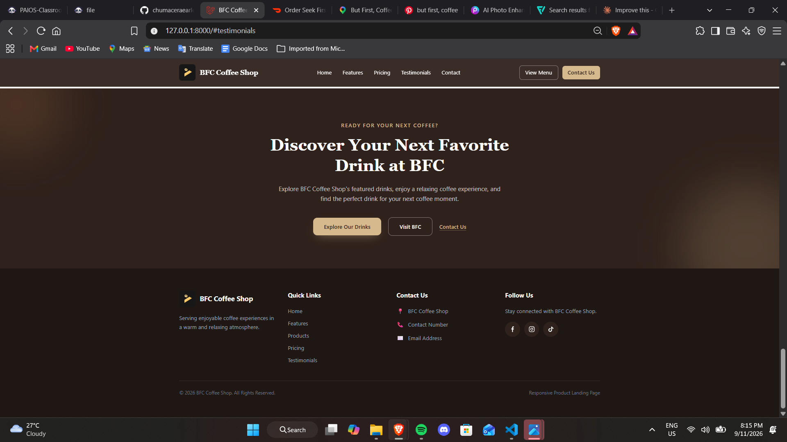
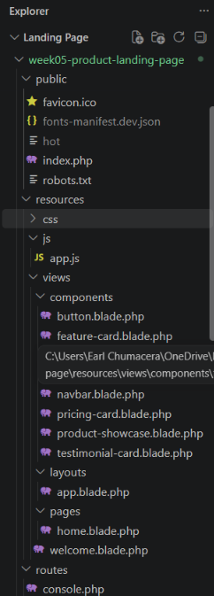
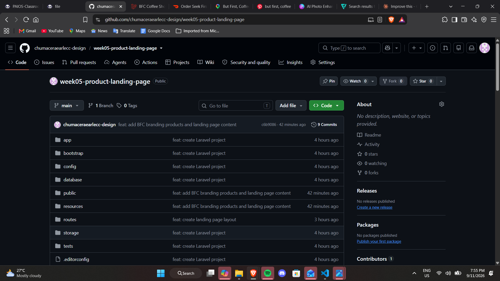

# Week 05 Mini Project 04 – Responsive Product Landing Page

## BFC Coffee Shop

A responsive product landing page developed using **Laravel, Blade Components, and Tailwind CSS**. The website is based on BFC Coffee Shop and presents coffee products through a modern, responsive, and reusable interface.

---

# Introduction

This project was developed for **ITST 302 – Client-Server Technologies** as part of the Week 05 Laboratory Activity: **Mini Project 04 – Responsive Product Landing Page**.

The main goal of the project is to create a modern and responsive product landing page for an existing business using Laravel and Tailwind CSS.

For this project, **BFC Coffee Shop / But First, Coffee** was selected as the existing business. The landing page presents featured coffee products, customer reviews, sample coffee packages, and other business-related content through a clean and responsive user interface.

Laravel was used to organize the web application, while Blade Components were used to create reusable sections of the website. Tailwind CSS was used for responsive layouts, colors, spacing, typography, hover effects, shadows, rounded corners, and other visual elements.

---

# Objectives

The objectives of this project are to:

1. Develop a responsive product landing page using Laravel.
2. Apply Laravel Blade templating to organize the user interface.
3. Create reusable Blade Components for different sections of the website.
4. Use Tailwind CSS to create a modern and responsive design.
5. Apply responsive Grid and Flexbox layouts.
6. Present products and business information in an organized manner.
7. Optimize the website for mobile, tablet, laptop, and desktop devices.
8. Apply hover effects, transitions, spacing, shadows, and rounded elements.
9. Practice proper Git and GitHub version control.
10. Document the development process using screenshots and project documentation.

---

# Business Selected

**Business Name:** BFC Coffee Shop / But First, Coffee

BFC Coffee Shop was selected as the existing business for this responsive product landing page.

The website follows a coffee-inspired design using brown, beige, cream, white, and neutral colors.

The project also uses BFC Coffee Shop branding, coffee product images, and customer feedback to create a more realistic presentation of the selected business.

---

# Development Environment

The following technologies and tools were used in developing this project:

- **Laravel** – Web application framework
- **PHP** – Server-side programming language
- **Blade** – Laravel templating engine
- **Tailwind CSS** – Utility-first CSS framework
- **Vite** – Front-end development and asset build tool
- **HTML** – Website structure
- **JavaScript** – Interactive elements and product transitions
- **Composer** – PHP dependency manager
- **NPM** – Front-end package manager
- **Git** – Version control
- **GitHub** – Repository hosting
- **Visual Studio Code** – Code editor
- **Google Chrome** – Web browser
- **Chrome DevTools** – Responsive design testing

---

# Installation and Setup

## 1. Clone the Repository

```bash
git clone https://github.com/chumaceraearlecc-design/week05-product-landing-page.git
```

## 2. Open the Project Directory

```bash
cd week05-product-landing-page
```

## 3. Install PHP Dependencies

```bash
composer install
```

## 4. Install Front-End Dependencies

```bash
npm install
```

## 5. Create the Environment File

Copy the `.env.example` file and rename the copy to:

```text
.env
```

## 6. Generate the Laravel Application Key

```bash
php artisan key:generate
```

## 7. Start the Vite Development Server

Open a terminal and run:

```bash
npm run dev
```

Keep this terminal running while developing the website.

## 8. Start the Laravel Development Server

Open another terminal and run:

```bash
php artisan serve
```

The application can then be accessed at:

```text
http://127.0.0.1:8000
```

---

# Project Structure

The important files and folders used in this project include:

```text
week05-product-landing-page/
│
├── app/
├── bootstrap/
├── config/
├── database/
│
├── public/
│   └── images/
│       ├── logo.jpg
│       ├── background.png
│       ├── americano.png
│       ├── caramel.png
│       ├── dark.png
│       ├── icespanishlatter.png
│       ├── matchaespresso-removebg-preview.png
│       ├── vanillalatte.png
│       ├── customer1.png
│       ├── customer2.png
│       └── customer3.png
│
├── resources/
│   ├── css/
│   │   └── app.css
│   │
│   ├── js/
│   │   └── app.js
│   │
│   └── views/
│       ├── components/
│       │   ├── navbar.blade.php
│       │   ├── hero.blade.php
│       │   ├── feature-card.blade.php
│       │   ├── product-showcase.blade.php
│       │   ├── pricing-card.blade.php
│       │   ├── testimonial-card.blade.php
│       │   ├── button.blade.php
│       │   └── footer.blade.php
│       │
│       ├── layouts/
│       │   └── app.blade.php
│       │
│       └── pages/
│           └── home.blade.php
│
├── routes/
│   └── web.php
│
├── screenshots/
│   ├── desktop.png
│   ├── laptop.png
│   ├── tablet.png
│   ├── mobile.png
│   ├── navbar.png
│   ├── hero.png
│   ├── features.png
│   ├── pricing.png
│   ├── testimonials.png
│   ├── footer.png
│   ├── vscode-structure.png
│   ├── blade-components.png
│   └── github-repository.png
│
└── README.md
```

---

# Landing Page Sections

## 1. Responsive Navbar

The navigation bar provides quick access to the major sections of the BFC Coffee Shop landing page.

The navigation bar includes:

- BFC Coffee Shop logo
- Home
- Features
- Pricing
- Testimonials
- Contact
- Action buttons

The navigation bar is responsive. On smaller screens, the desktop navigation is replaced with a mobile menu to make navigation easier.

---

## 2. Hero Section

The Hero section serves as the main introduction to BFC Coffee Shop.

It includes:

- BFC Coffee Shop branding
- Coffee shop background image
- Main headline
- Short description
- Primary action button
- Secondary action button
- Featured coffee product
- Automatic product transition

The featured coffee product automatically changes using a smooth fade transition.

Featured products include:

- Americano
- Caramel
- Dark Coffee
- Spanish Latte
- Matcha Espresso
- Vanilla Latte

---

## 3. Features Section

The Features section presents six characteristics of the BFC Coffee Shop experience.

The six feature cards are:

1. Freshly Brewed Coffee
2. Quality Ingredients
3. Delicious Pairings
4. Cozy Atmosphere
5. Friendly Service
6. Great Value

Each feature is displayed using a reusable Blade Component containing an icon, title, and short description.

---

## 4. Product Showcase

The Product Showcase presents featured BFC Coffee Shop drinks using responsive product cards.

The products displayed include:

- Americano
- Caramel
- Dark Coffee
- Spanish Latte
- Matcha Espresso
- Vanilla Latte

The product cards use responsive Grid layouts and automatically adjust depending on the user's screen size.

Fixed image containers and `object-contain` were used to make the different product images appear more consistent.

The section also includes key highlights related to the desktop and mobile experience of the landing page.

---

## 5. Coffee Packages / Pricing

The Pricing section demonstrates three sample coffee packages.

### Solo Coffee – ₱119

- 1 Featured Coffee Drink
- Choice of Hot or Iced
- Perfect for Individual Orders

### Coffee + Snack – ₱169

- 1 Featured Coffee Drink
- 1 Selected Snack
- Great for Coffee Breaks

### BFC Bundle – ₱229

- 2 Featured Drinks
- 1 Selected Snack
- Perfect for Sharing

> **Note:** These packages and prices are sample content created specifically for this academic landing page project. They should not be treated as official BFC Coffee Shop pricing or offers.

---

## 6. Customer Testimonials

The Testimonials section presents customer feedback about BFC Coffee Shop.

Each testimonial is displayed using the reusable:

```text
testimonial-card.blade.php
```

The testimonial cards contain:

- Customer photo
- Customer name
- Customer type or position
- Star rating
- Customer feedback

This section demonstrates how customer feedback can be organized using reusable and responsive cards.

---

## 7. Call to Action

The Call to Action section encourages visitors to interact with the website.

The section uses:

- Large heading
- Short supporting description
- Multiple action buttons
- Contrasting background
- Hover effects
- Responsive button layout

The buttons automatically stack vertically on smaller screens and display horizontally on larger screens.

---

## 8. Footer

The Footer provides additional business and navigation information.

It contains:

- BFC Coffee Shop logo
- Company information
- Quick Links
- Contact information section
- Social media icons
- Copyright information

The Footer uses a responsive Grid layout that automatically adjusts depending on the screen size.

---

# Reusable Blade Components

Reusable Blade Components were created to reduce repeated code and improve project organization.

The following components were created:

```text
navbar.blade.php
hero.blade.php
feature-card.blade.php
product-showcase.blade.php
pricing-card.blade.php
testimonial-card.blade.php
button.blade.php
footer.blade.php
```

Using reusable components makes the website easier to organize and maintain.

Instead of placing every section directly inside `home.blade.php`, major interface elements are separated into individual Blade Components.

---

# Main Layout

The project uses:

```text
resources/views/layouts/app.blade.php
```

as the main Blade layout.

The Home page extends this layout using:

```blade
@extends('layouts.app')
```

The layout contains the main HTML structure and loads the project's CSS and JavaScript files using Vite.

---

# Tailwind CSS Implementation

Tailwind CSS was used throughout the website for styling and responsive design.

Tailwind utilities were used for:

- Grid layouts
- Flexbox layouts
- Responsive breakpoints
- Width and height
- Padding
- Margins
- Typography
- Background colors
- Text colors
- Borders
- Rounded corners
- Shadows
- Hover effects
- Transitions
- Alignment
- Spacing

Responsive breakpoints used in the project include:

```text
sm:
md:
lg:
```

These responsive utilities allow the interface to change depending on the available screen width.

---

# Responsive Design

The BFC Coffee Shop landing page was tested using multiple screen sizes.

The website was optimized for:

- Mobile
- Tablet
- Laptop
- Desktop

The following interface elements were tested for responsiveness:

- Navbar
- Hero section
- Feature cards
- Product cards
- Coffee package cards
- Testimonials
- CTA buttons
- Footer

Tailwind CSS Grid, Flexbox, and responsive breakpoint utilities were used to make the layout adapt to different devices.

---

# Screenshots

## Desktop View


---

## Laptop View


---

## Tablet View


---

## Mobile View



---

## Navbar


---

## Hero Section



---

## Features Section



---

## Pricing Section



---

## Testimonials Section



---

## Footer



---

## VS Code Project Structure



---

## Blade Components


---

## GitHub Repository



---

# Problems Encountered and Solutions

## Problem 1 – Vite Manifest Error

During development, the following error was encountered:

```text
Vite manifest not found
```

### Solution

The issue occurred because the Vite development server was not running.

The problem was resolved by running:

```bash
npm run dev
```

The Vite development server was kept running while Laravel was running in another terminal.

---

## Problem 2 – Responsive Navigation

The original navigation bar worked properly on desktop but needed improvement for smaller devices.

### Solution

Responsive Tailwind CSS classes were added and a mobile navigation menu was created.

JavaScript was used to open and close the mobile navigation menu.

---

## Problem 3 – Product Image Sizes

The coffee product images had different original dimensions and transparent spacing, causing some products to appear larger or smaller than others.

### Solution

Fixed product image containers were created and the following property was used:

```text
object-contain
```

Individual image dimensions were also adjusted to create a more consistent product presentation.

---

## Problem 4 – Product Slider

The Hero section needed a way to display multiple coffee products without requiring the user to manually change them.

### Solution

JavaScript was used to automatically change the featured coffee product.

An opacity transition was added to create a smooth fade effect between products.

---

## Problem 5 – Mobile Layout

Some website sections needed adjustments when displayed on smaller screens.

### Solution

Responsive Tailwind CSS breakpoints were applied to Grid, Flexbox, text sizes, spacing, and buttons.

The website was then tested using mobile, tablet, laptop, and desktop screen sizes.

---

# Solutions and Improvements

During the development process, several improvements were made to the landing page:

- Added BFC Coffee Shop branding
- Added an actual BFC logo
- Added coffee product images
- Added a coffee shop background image
- Improved responsive navigation
- Added a mobile navigation menu
- Created reusable Blade Components
- Added six feature cards
- Added a responsive product showcase
- Improved product image sizing
- Added sample coffee packages
- Added customer testimonials
- Added an automatic product fade transition
- Added hover effects and animations
- Improved typography and spacing
- Added responsive CTA buttons
- Added a responsive Footer
- Added social media icons
- Tested the website on multiple screen sizes

---

# Before and After

## Before

The initial version of the project contained a basic Laravel landing page structure with limited styling and content.

The first version focused on establishing:

- Laravel project structure
- Main Blade layout
- Basic navigation
- Basic Hero section
- Initial Tailwind CSS styling

## After

The final version was improved by adding:

- BFC Coffee Shop branding
- Responsive Navbar
- Mobile navigation
- Coffee shop Hero background
- Automatic featured product transition
- Six reusable feature cards
- Featured coffee products
- Responsive product showcase
- Coffee package cards
- Customer testimonials
- Call to Action section
- BFC logo
- Social media icons
- Complete Footer
- Responsive layouts for multiple devices

The final result is a more complete, organized, interactive, and responsive product landing page.

---

# Reflection

Developing the BFC Coffee Shop responsive product landing page helped me understand how Laravel, Blade Components, and Tailwind CSS can work together when building a modern website.

One of the most important things I learned from this project was how reusable Blade Components can make a Laravel project more organized. Instead of placing all of the HTML and Tailwind CSS code inside one file, I separated major parts of the website into components such as the Navbar, Hero section, feature cards, product showcase, pricing cards, testimonial cards, buttons, and Footer. This made the project easier to understand, edit, and maintain.

I also learned more about responsive web design. While developing the landing page, I tested the website on mobile, tablet, laptop, and desktop screen sizes. I needed to make sure that navigation links, product cards, images, buttons, testimonials, and other elements adjusted properly depending on the available screen width. Tailwind CSS breakpoints, Grid, and Flexbox helped me create layouts that automatically adapt to different devices.

Another challenge I encountered was displaying product images consistently because the original images had different dimensions and transparent spaces. I solved this by creating fixed image containers and using `object-contain`. I also adjusted individual product image sizes to make the product cards look more consistent.

I also learned how JavaScript can be combined with Laravel Blade to add simple interactive features. In the Hero section, I created an automatic product transition that changes the featured coffee drink using a smooth fade effect.

Git and GitHub were also important parts of this project. Using meaningful commits allowed me to keep track of the different stages of development, from creating the Laravel layout to adding responsive components, products, testimonials, screenshots, and documentation.

Overall, this project improved my understanding of Laravel Blade templating, reusable components, Tailwind CSS, responsive design, JavaScript interaction, Git, and GitHub. It also helped me understand how an existing business can be used as inspiration when designing and developing a responsive product landing page.

---

# GitHub Repository

**Repository Name:**

```text
week05-product-landing-page
```

**Repository:**

https://github.com/chumaceraearlecc-design/week05-product-landing-page

---

# Author

**Earl Chumacera**

ITST 302 – Client-Server Technologies

---

# Academic Project Notice

This website was created for educational purposes as part of an ITST 302 – Client-Server Technologies laboratory activity.

BFC Coffee Shop / But First, Coffee was selected as the existing business for this landing page project.

Sample packages and pricing included in the website were created for academic demonstration purposes and are not presented as official BFC Coffee Shop offers.